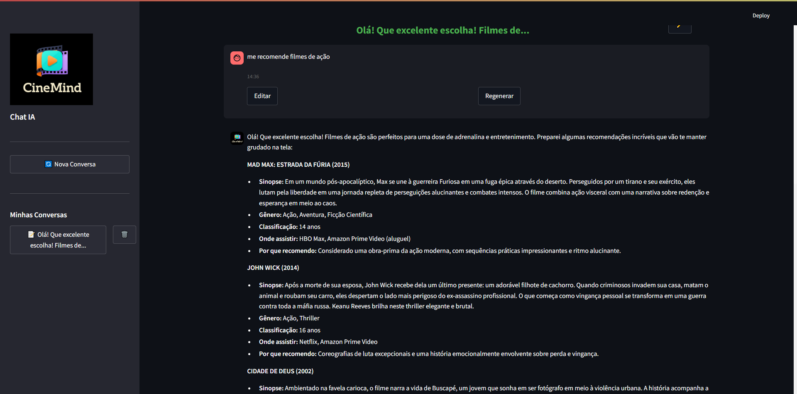

<div align="center" style="justify-content:center; display:flex; flex-direction:column; margin-bottom:50px; gap:20px">

</div>

# CineMind - Chat IA com Amazon Bedrock

CineMind é uma aplicação de chat inteligente desenvolvida com Streamlit que utiliza o Amazon Bedrock para fornecer respostas de IA através do modelo Claude Sonnet 4. A aplicação oferece uma interface web moderna com funcionalidades como histórico de conversas, edição de mensagens e suporte a RAG (Retrieval-Augmented Generation).

## 🚀 Funcionalidades

- **Chat Inteligente**: Conversas com IA usando Claude Sonnet 4 via Amazon Bedrock
- **Histórico de Conversas**: Salve e gerencie múltiplas conversas
- **Edição de Mensagens**: Edite mensagens enviadas e regenere respostas
- **Suporte RAG**: Adicione contexto através de texto direto
- **Interface Moderna**: Design responsivo e intuitivo
- **Autenticação**: Sistema de login com controle de acesso
- **Gerenciamento de Sessões**: Controle automático de sessões de chat

## 📋 Pré-requisitos

- Python 3.8 ou superior
- Conta AWS com acesso ao Amazon Bedrock
- AWS CLI configurado
- Acesso ao modelo Claude Sonnet 4 no Amazon Bedrock

## 🛠️ Instalação

### 1. Clone o repositório

```bash
git clone <url-do-repositorio>
cd cinemind
```

### 2. Instale as dependências

```bash
pip install -r requirements.txt
```

**Dependências principais:**

```
streamlit
boto3
requests
PyPDF2
pandas
```

### 3. Configure o AWS CLI

Configure suas credenciais AWS:

```bash
aws configure
```

Ou configure um perfil específico:

```bash
aws configure --profile grupo06
```

Insira suas credenciais:

- AWS Access Key ID
- AWS Secret Access Key
- Default region: `us-east-1`
- Default output format: `json`

### 4. Verifique o acesso ao Bedrock

Teste se você tem acesso ao Amazon Bedrock:

```bash
aws bedrock list-foundation-models --region us-east-1
```

### 5. Configure as permissões IAM

Certifique-se de que sua conta AWS possui as seguintes permissões:

```json
{
    "Version": "2012-10-17",
    "Statement": [
        {
            "Effect": "Allow",
            "Action": [
                "bedrock:InvokeModel",
                "bedrock:ListFoundationModels"
            ],
            "Resource": "*"
        }
    ]
}
```

## 🚀 Executando o Projeto

### Execução Local

1. **Execute a aplicação:**

```bash
streamlit run app.py
```

2. **Acesse a aplicação:**
   - Abra seu navegador em `http://localhost:8501`

3. **Faça login:**
   - Usuário: `cinemind`
   - Senha: `edngrupo06`

### Configuração de Variáveis de Ambiente

Você pode configurar o perfil AWS através de variável de ambiente:

```bash
AWS_PROFILE=grupo06
streamlit run app.py
```

## ⚙️ Configuração

### Parâmetros do Modelo

Os parâmetros do modelo Claude podem ser ajustados no arquivo `app.py`:

```python
model_params = {
    "temperature": 0.6,     # Criatividade (0.0 - 1.0)
    "top_p": 0.8,          # Nucleus sampling
    "top_k": 50,           # Top-K sampling
    "max_tokens": 1800,    # Máximo de tokens na resposta
}
```

### Autenticação

Para alterar as credenciais de login, modifique no arquivo `app.py`:

```python
# Linha ~150
if hmac.compare_digest(st.session_state["username"].strip(), "seu_usuario") and \
   hmac.compare_digest(st.session_state["password"].strip(), "sua_senha"):
```

### Perfil AWS

Para alterar o perfil AWS padrão, modifique no arquivo `app.py`:

```python
# Linha ~18
PROFILE_NAME = os.environ.get("AWS_PROFILE", "seu_perfil")
```

## 📱 Funcionalidades da Interface

### Chat

- Digite mensagens no campo de texto
- Use `Enter` para enviar (Shift+Enter para nova linha)
- Clique em "Enviar" para processar a mensagem

### Histórico

- **Nova Conversa**: Cria uma nova sessão de chat
- **Carregar Conversa**: Clique em qualquer conversa na barra lateral
- **Excluir Conversa**: Use o ícone 🗑️ ao lado de cada conversa
- **Renomear**: Use o ícone ✏️ no título da conversa

### Edição de Mensagens

- **Editar**: Clique em "Editar" em qualquer mensagem do usuário
- **Regenerar**: Clique em "Regenerar" para obter nova resposta
